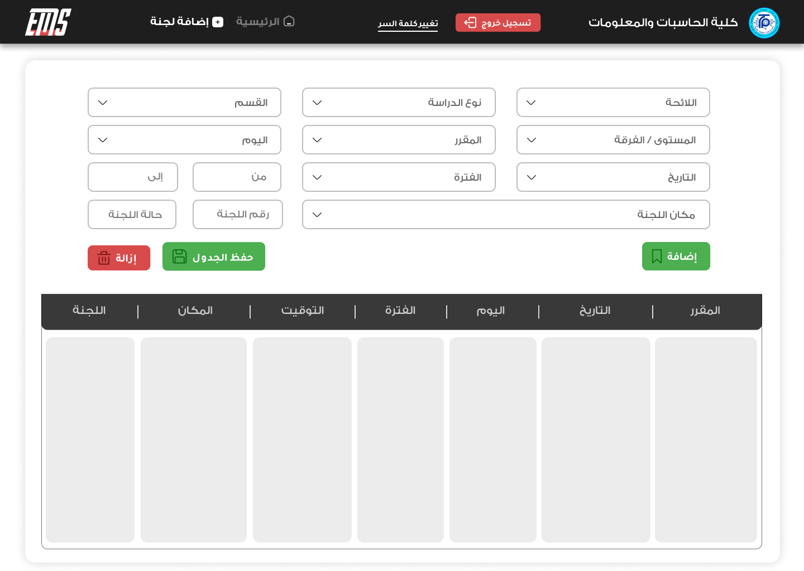

# Examination Committees Management System
 
EMS is a university system for managing 'Exam Committees' for all faculties,
utilizes .NET 8 as backend and ReactJS as frontend frameworks.

## Content
-  [Features](#features)
-  [Technologies](#technologies)
-  [User Interface](#user-interface)
-  [Contributors Team](#contributors-team)

## Features
- SuperAdmin access for all exam committees data over all the university.
- FacultyAdmin full access and management for faculty exam committees.
- Creating exam committees schedules with all it’s data.
- Students, Observers and Invigilators distribution over committees.
- Students, Observers and Invigilators their schedule and data access.
- Admins Dashboard.
- Emails Communication.

## Technologies
### Backend
- ASP .NET core 8 WebApi.
- AspNetCore.Identity: for authentication and authorization.
- EF core as ORM.
- SQL Server as DBMS.
- JWT: as token-based authentication.
- Automapper: For object-object mapping.
- DTOs: data transfer between layers.
- UnitOfWork & Repository pattern.

### Frontend (https://github.com/AbdelattyBadwy16/EMS-System-Frontend)
- ReactJS
- Typescript
- Tailwind for styling
- Figma for UI design

# User Interface
Some UI images:

 
 
 

# Contributors Team
- [**Abdelaty Badawy**](https://github.com/AbdelattyBadwy16): Fullstack developer
- [**Mohamed Fadel**](https://github.com/Mohamed-Fadel-10): Backend developer
- [**Mohamed Ali**](https://github.com/mohdali300): Backend developer & UI designer
- [**Eman Hamam**](https://github.com/EmanHamam): Backend developer
- [**Menna Mohamed**](https://github.com/menna7634): Backend developer
- [**Saeed Youseef**](https://github.com/Saeed-Youseef1): Frontend developer
- [**Hedra Emad**](https://github.com/hedra-emad): Frontend developer
- [**Sara Gad-Elkarim**](https://github.com/saragad2022): Frontend developer
- [**Arwa Ahmed**](https://github.com/Arwa-Ameen): Frontend developer

---
Star it and feel free to ask, contribute and share it with others.
